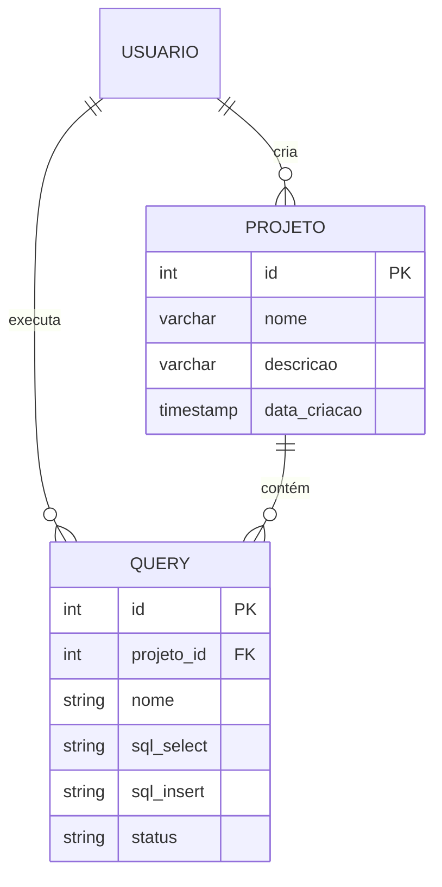
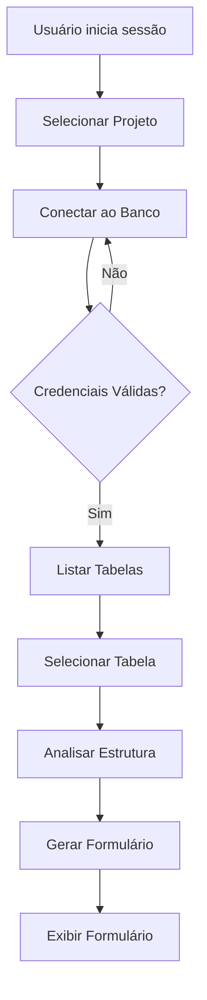
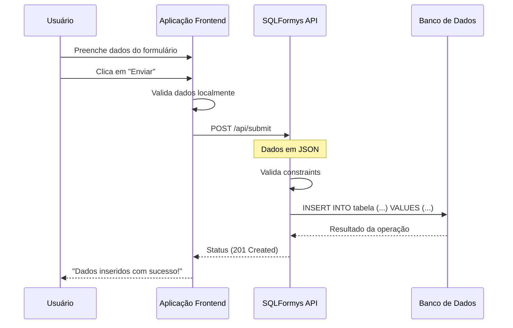
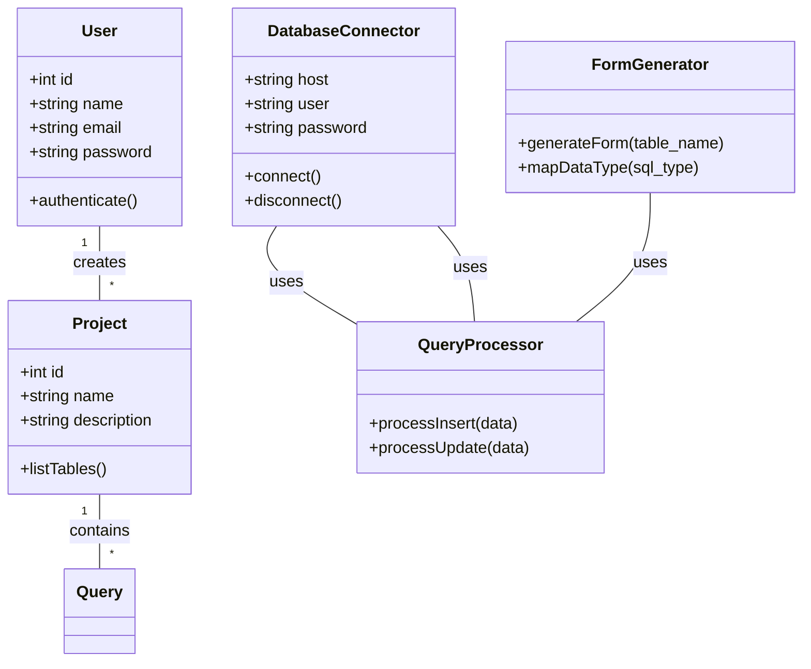

# SQLFormys

**(Formulário Web a partir de SQL Query)**

## 1. Objetivo do Projeto

O SQLFormys é uma ferramenta web que visa transformar **consultas SQL (SELECT)** em **formulários de cadastro (INSERT/UPDATE)** dinâmicos. A aplicação permitirá que usuários sem conhecimento técnico em programação gerem interfaces de captura de dados diretamente a partir da estrutura do banco de dados.

O projeto visa explorar a integração entre diferentes tecnologias open source para criação de uma solução robusta e escalável.

## 2. Requisitos Funcionais (RF)

| ID | Funcionalidade | Descrição |
| :--- | :--- | :--- |
| **RF001** | **Conexão com Banco de Dados** | O sistema deve permitir a conexão com bancos de dados relacionais (MySQL, PostgreSQL, SQLite) através de credenciais (host, porta, usuário, senha). |
| **RF002** | **Listagem de Tabelas** | Após a conexão, o sistema deve listar todas as tabelas disponíveis no banco de dados. |
| **RF003** | **Visualização de Estrutura** | O usuário deve poder visualizar a estrutura de uma tabela (nome das colunas, tipo de dado, constraints). |
| **RF004** | **Definição de Chaves** | O sistema deve identificar automaticamente a chave primária (PK) e chaves estrangeiras (FK) da tabela. |
| **RF005** | **Construção da Query SELECT** | O sistema deve gerar uma query SELECT baseada nas colunas da tabela, permitindo exclusão de colunas. |
| **RF006** | **Geração do Formulário** | O sistema deve gerar um formulário HTML/React com campos correspondentes aos campos da query. |
| **RF007** | **Mapeamento de Tipos** | O sistema deve mapear tipos de dados SQL (INT, VARCHAR, DATE) para tipos de input HTML (number, text, date). |
| **RF008** | **Validação de Campos** | O sistema deve aplicar validações básicas baseadas em constraints (NOT NULL, UNIQUE). |
| **RF009** | **Processamento de Dados** | O sistema deve processar os dados submetidos e gerar uma query INSERT ou UPDATE. |
| **RF010** | **Feedback ao Usuário** | O sistema deve exibir mensagens de sucesso ou erro após o processamento dos dados. |
| **RF011** | **Histórico de Consultas** | O sistema deve manter um histórico das consultas geradas e dos dados inseridos. |

## 3. Requisitos Não Funcionais (RNF)

| ID | Categoria | Requisito |
| :--- | :--- | :--- |
| **RNF001** | **Performance** | O carregamento da lista de tabelas deve ocorrer em até 2 segundos. |
| **RNF002** | **Performance** | A geração do formulário deve ser instantânea (< 1 segundo). |
| **RNF003** | **Usabilidade** | A interface deve ser responsiva, funcionando em dispositivos desktop e mobile. |
| **RNF004** | **Segurança** | As credenciais do banco de dados não devem ser armazenadas em texto plano. |
| **RNF005** | **Segurança** | O sistema deve prevenir injeção de SQL através de consultas parametrizadas. |
| **RNF006** | **Manutenibilidade** | O código deve seguir os princípios SOLID e DRY. |
| **RNF007** | **Disponibilidade** | O sistema deve estar disponível 24/7 (em ambiente de produção). |
| **RNF008** | **Compatibilidade** | Suporte a PostgreSQL 13+ e MySQL 8.0+. |

## 4. Modelo de Dados (Entidade-Relacionamento)

O modelo de dados descreve as principais entidades envolvidas no sistema.

### Entidades Principais:



## 5. Regras de Negócio

1. **Regra de Permissão:** Apenas usuários autenticados podem criar projetos e executar consultas.
2. **Regra de Inviolabilidade:** O sistema não deve permitir a modificação da estrutura da tabela através do formulário (apenas inserção/atualização de dados).
3. **Regra de Transformação:** Campos de texto longo (TEXT, BLOB) devem ser mapeados para campos de textarea no formulário.
4. **Regra de Relacionamento:** Ao selecionar um valor em um campo de FK, o sistema deve buscar os valores disponíveis na tabela referenciada.

## 6. Casos de Uso

### UC01: Criar Projeto

**Ator:** Usuário Autenticado

| Passo | Ação |
| :--- | :--- |
| **1** | O usuário acessa a funcionalidade "Novo Projeto". |
| **2** | O sistema exibe o formulário de projeto. |
| **3** | O usuário insere nome e descrição. |
| **4** | O usuário clica em "Salvar". |
| **5** | O sistema valida os dados e cria o projeto. |
| **6** | O sistema retorna à lista de projetos. |

### UC02: Gerar Formulário a partir de Tabela

**Ator:** Usuário Autenticado

| Passo | Ação |
| :--- | :--- |
| **1** | O usuário seleciona o projeto desejado. |
| **2** | O usuário clica em "Conectar ao Banco". |
| **3** | O usuário insere as credenciais do banco. |
| **4** | O sistema valida a conexão. |
| **5** | O sistema lista as tabelas disponíveis. |
| **6** | O usuário seleciona uma tabela. |
| **7** | O sistema gera o formulário dinâmico. |

### UC03: Inserir Dados

**Ator:** Usuário Não Autenticado (Público)

| Passo | Ação |
| :--- | :--- |
| **1** | O usuário acessa o link público do formulário. |
| **2** | O usuário preenche os campos do formulário. |
| **3** | O usuário clica em "Enviar". |
| **4** | O sistema valida os dados localmente. |
| **5** | O sistema envia os dados para a API. |
| **6** | O sistema processa a inserção no banco de dados. |
| **7** | O sistema exibe mensagem de sucesso ou erro. |

## 7. Diagrama de Casos de Uso

```mermaid
    usecaseDiagram
        actor "Usuário Autenticado" as USER
        actor "Usuário Público" as PUBLIC
        
        package "Sistema SQLFormys" {
            usecase "Autenticar Usuário" as UC_AUTH
            usecase "Criar Projeto" as UC_CREATE_PROJECT
            usecase "Listar Tabelas" as UC_LIST_TABLES
            usecase "Gerar Formulário" as UC_GEN_FORM
            usecase "Inserir Dados" as UC_INSERT_DATA
            usecase "Visualizar Histórico" as UC_VIEW_HISTORY
        }
        
        USER --> UC_AUTH
        USER --> UC_CREATE_PROJECT
        USER --> UC_LIST_TABLES
        USER --> UC_GEN_FORM
        PUBLIC --> UC_INSERT_DATA
        USER --> UC_VIEW_HISTORY
        
        UC_CREATE_PROJECT ..> UC_LIST_TABLES : <<include>>
        UC_GEN_FORM ..> UC_LIST_TABLES : <<include>>
```

## 8. Diagrama de Atividades (Fluxo de Geração de Formulário)



## 9. Diagrama de Sequência (Processamento de Dados)



## 10. Diagrama de Classes



## 11. Matriz de Rastreabilidade de Requisitos

| Requisito | Caso de Uso | Diagrama | Teste Correspondente |
| :--- | :--- | :--- | :--- |
| **RF001** | UC02 | UC02, UC03 | **TC001:** Validação de conexão com banco de dados. |
| **RF002** | UC02 | UC02 | **TC002:** Listagem de tabelas em até 2 segundos. |
| **RF003** | UC02 | UC02 | **TC003:** Exibição correta da estrutura da tabela. |
| **RF004** | UC02 | UC02 | **TC004:** Identificação correta de chaves primárias e estrangeiras. |
| **RF005** | UC02 | UC02 | **TC005:** Geração de query SELECT com colunas selecionadas. |
| **RF006** | UC02 | UC02, UC03 | **TC006:** Geração de formulário dinâmico. |
| **RF007** | UC02 | UC02 | **TC007:** Mapeamento correto de tipos de dados. |
| **RF008** | UC03 | UC03 | **TC008:** Validação de campos obrigatórios no frontend. |
| **RF009** | UC03 | UC03 | **TC009:** Processamento correto de inserção de dados. |
| **RF010** | UC03 | UC03 | **TC010:** Exibição de mensagens de sucesso/erro. |
| **RF011** | UC01 | UC01 | **TC011:** Histórico de projetos e consultas. |

## 12. Critérios de Aceitação

### Critérios de Sucesso:

1. **Conexão Estabelecida:** O sistema consegue conectar a diferentes bancos de dados (PostgreSQL, MySQL, SQLite) sem erros.
2. **Formulário Funcional:** O usuário consegue gerar, preencher e submeter dados através do formulário gerado.
3. **Dados Inseridos:** Os dados submetidos são corretamente inseridos na tabela correspondente do banco de dados.
4. **Interface Responsiva:** A interface se adapta corretamente a diferentes tamanhos de tela.
5. **Segurança:** As credenciais do banco de dados são tratadas de forma segura e as consultas são parametrizadas.

### Critérios de Não Sucesso:

1. **Falha na Conexão:** O sistema não consegue conectar ao banco de dados devido a credenciais inválidas ou rede indisponível.
2. **Erro de Validação:** O sistema não permite o envio de dados que violem as constraints do banco (ex: violação de chave primária).
3. **Quebra de Schema:** O sistema não permite a modificação da estrutura da tabela através do formulário.
4. **Injeção de SQL:** O sistema não é vulnerável a ataques de injeção de SQL.

---

**Status:** Rascunho
**Versão:** 1.0
**Data:** 2026-05-01
**Autor:** Regivaldo Fraga

## 13. Escopo do Projeto

### O que está INCLUÍDO (Scope):

1. **Frontend Moderno:** Interface responsiva construída com React, Next.js 16 e TypeScript.
2. **Backend Robusto:** API RESTful desenvolvida em Go 1.24+ e htmx.
3. **Integração com BD:** Suporte a PostgreSQL, SQL Server, MySQL e SQLite com conexão via strings de conexão.
4. **Geração Dinâmica de Formulários:** Mapeamento automático de tipos de dados SQL para componentes React.
5. **Validação Inteligente:** Verificação de constraints (NOT NULL, UNIQUE, FOREIGN KEY) antes do envio dos dados.
6. **Persistência de Dados:** Armazenamento de projetos, queries e histórico de inserções em banco de dados.
7. **Segurança Básica:** Autenticação de usuários e proteção contra injeção de SQL.
8. **Histórico e Auditoria:** Logs de operações e histórico de consultas geradas.

### O que está FORA do Escopo (Out of Scope):

1. **Editor Visual de SQL:** A aplicação não oferecerá um editor visual para criação de consultas (apenas entrada de texto).
2. **Upload de Arquivos:** Funcionalidades de upload de arquivos (PDFs, imagens) não serão suportadas nesta versão.
3. **Notificações:** Sistema de notificações (e-mail, push) não está incluído.
4. **Dashboard Analítico:** Relatórios avançados ou dashboards de BI estão fora do escopo.
5. **Integração com APIs Externas:** Conexão com APIs de terceiros não será implementada.
6. **Gerenciamento de Permissões Granular:** Controle de permissões além do básico de autenticação de usuários.
7. **Multi-idioma (i18n):** A aplicação será desenvolvida em português brasileiro (pt-BR).


## 14. Referências Bibliográficas

[1] Go Programming Language Specification, https://go.dev/ref/spec (Acessado em 25 de abr. de 2026).
[2] Next.js 16 Documentation, https://nextjs.org/docs (Acessado em 25 de abr. de 2026).
[3] Htmx Documentation, https://htmx.org/docs/ (Acessado em 25 de abr. de 2026).
[4] TypeScript Documentation, https://www.typescriptlang.org/docs/ (Acessado em 25 de abr. de 2026).  


## 15. Testes

### Plano de Testes

O plano de testes será composto por:

1. Testes Unitários: Testes isolados de cada componente do sistema.
2. Testes de Integração: Testes de integração entre os componentes do sistema.
3. Testes de Sistema: Testes de ponta a ponta do sistema.
4. Testes de Aceitação: Testes de aceitação com usuários reais.

### Casos de Teste

| ID do Teste | Módulo | Descrição do Teste | Tipo de Teste | Resultado Esperado |
| :--- | :--- | :--- | :--- | :--- |
| **TC001** | Conexão com BD | Testar conexão com banco de dados PostgreSQL | Teste de Integração | Conexão estabelecida com sucesso |
| **TC002** | Listagem de Tabelas | Testar listagem de tabelas | Teste de Integração | Tabelas listadas corretamente |
| **TC003** | Geração de Formulário | Testar geração de formulário | Teste de Integração | Formulário gerado corretamente |
| **TC004** | Validação de Dados | Testar validação de dados | Teste de Integração | Validação correta dos dados |
| **TC005** | Inserção de Dados | Testar inserção de dados | Teste de Integração | Dados inseridos corretamente |
| **TC006** | Histórico de Consultas | Testar histórico de consultas | Teste de Integração | Histórico registrado corretamente |

## 16. Cronograma

### Fases do Projeto

O projeto será dividido em 4 fases:

1. Fase de Planejamento: 2 semanas
2. Fase de Desenvolvimento: 8 semanas
3. Fase de Testes: 2 semanas
4. Fase de Implantação: 1 semana


## 17. Requisitos de Instalação

### Pré-requisitos

O sistema requer os seguintes pré-requisitos:

1. Go 1.24+
2. Next.js 16
3. htmx
4. TypeScript

### Instalação

```bash
# Clonar o repositório
git clone https://github.com/regifraga/projeto-aplicado.git

# Entrar no diretório do projeto
cd projeto-aplicado

# Instalar dependências do backend
cd backend
go mod tidy

# Instalar dependências do frontend
cd ../frontend
npm install

# Iniciar o servidor de desenvolvimento
npm run dev
```

